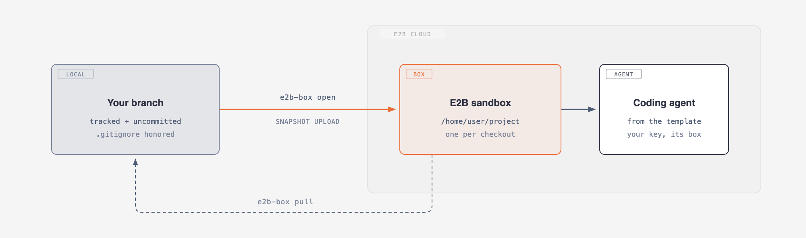
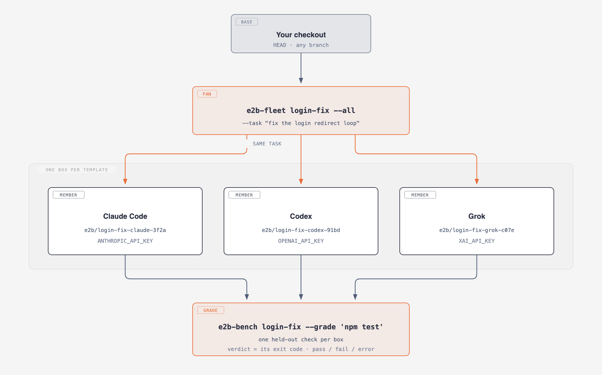
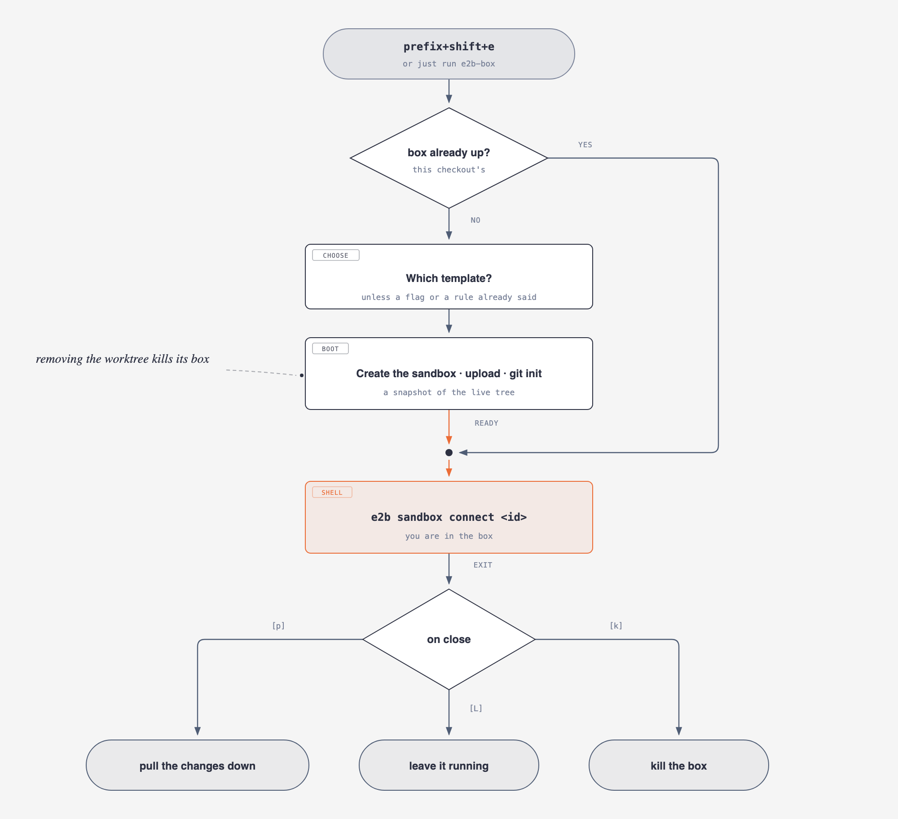

# herdr-e2b

[](https://github.com/e2b-dev/herdr-e2b-sandbox/actions/workflows/ci.yml)

A [herdr](https://herdr.dev) plugin that sends your branch — **as it sits on
disk right now, uncommitted changes and all** — into a fresh
[E2B](https://e2b.dev) cloud sandbox. No push, no clone, no credentials but the
ones you put there. Works from any checkout; a herdr worktree additionally
tears its sandbox down when the worktree is removed.

<picture>
  <source media="(prefers-color-scheme: dark)" srcset="assets/delegate-dark.png">
  
</picture>

## Two things it is for

**1 · Delegate this branch.** You are on a branch, you want the work done
somewhere that isn't your laptop. `e2b-box` uploads the checkout, boots a box
from a template that already ships a coding agent, and drops you in its shell.
`pull` brings the diff home.

**2 · Race a fleet, then grade it.** One task, one box per agent, all at once —
Claude Code, Codex, Grok, OpenCode, Amp, Droid and Prime work the same starting
point in parallel, and `e2b-bench` runs one held-out check inside every box to
say which of them actually did it. Best-of-N, or one harness's feature you can't
get from the others.

<picture>
  <source media="(prefers-color-scheme: dark)" srcset="assets/fleet-dark.png">
  
</picture>

## Install

```bash
herdr plugin install e2b-dev/herdr-e2b-sandbox   # build step links e2b-box onto PATH
./install.sh                                     # prompts for your E2B API key, chmod 600
```

Needs **herdr ≥ 0.7.0**, **Node ≥ 22**, **jq**, the `e2b` CLI on PATH, and an
[E2B API key](https://e2b.dev/dashboard). The key goes in `[secrets].e2b_api_key`
in the plugin config (`~/.config/herdr/plugins/config/e2b-dev.herdr-e2b/config.toml`), or
in `E2B_API_KEY`, which wins if both are set.

Bind the three verbs you press (`prefix+e` is herdr's own `edit_scrollback` —
stay off it):

```toml
[[keys.command]]
key = "prefix+shift+e"                                          # one box, this checkout
command = "herdr plugin action invoke open --plugin e2b-dev.herdr-e2b"

[[keys.command]]
key = "prefix+shift+f"                                          # a fleet, off this checkout
command = "herdr plugin action invoke fleet --plugin e2b-dev.herdr-e2b"

[[keys.command]]
key = "prefix+shift+d"                                          # the board, every box
command = "herdr plugin action invoke dashboard-toggle --plugin e2b-dev.herdr-e2b"
```

`prefix+shift+d` is herdr's own `close_workspace` out of the box — this takes it
over. Keep that verb by moving it first (`close_workspace = "prefix+shift+x"` in
the `[keys]` table), or give the board a different key.

> Local dev: `herdr plugin link /path/to/herdr-e2b-sandbox && ./install.sh`.

## Quick start

```bash
cd ~/some/checkout
e2b-box                             # pick a template, boot, land in the box's shell
e2b-box exec 'npm test'             # …or run one command and get JSON back
e2b-box pull                        # bring the box's changes down

e2b-fleet                           # name a task, tick a roster, watch the board
e2b-bench login-fix --grade 'npm test'
```

Nothing goes to the cloud on its own — you decide which checkouts go up:

<picture>
  <source media="(prefers-color-scheme: dark)" srcset="assets/lifecycle-dark.png">
  
</picture>

## Agents, templates and keys

A template ships the agent, not its credential. Give each template the key its
own agent reads and every box boots ready to work — keyed by template, so a
`base` box gets nothing:

```toml
[templates.claude.env]
ANTHROPIC_API_KEY = "sk-ant-…"
[templates.codex.env]
OPENAI_API_KEY = "sk-…"

[sandbox.env]                    # optional — every box, whatever it booted from
HTTPS_PROXY = "http://proxy.internal:3128"
```

| Agent | Template | Key it reads | Started unattended as |
| --- | --- | --- | --- |
| Claude Code | `claude` | `ANTHROPIC_API_KEY` | `claude --dangerously-skip-permissions` |
| Codex | `codex` | `OPENAI_API_KEY` | `codex --dangerously-bypass-approvals-and-sandbox` |
| Grok | `grok` | `XAI_API_KEY` | `grok --always-approve` |
| OpenCode | `opencode` | whichever provider key you point it at | `opencode --auto --prompt` |
| Amp | `amp` | `AMP_API_KEY` | `amp --dangerously-allow-all` |
| Droid | `droid` | `FACTORY_API_KEY` | `droid` |
| Prime | `prime` | `PRIME_API_KEY`, or an `ANTHROPIC_API_KEY` / `OPENAI_API_KEY` you already pay for | `prime-agent` |
| — | `base` | — | nothing (a control arm) |

These are E2B's public [agent templates](https://e2b.dev/docs/agents); names are
per-cluster (`e2b template list`), and one that isn't built on yours falls back
to `base` and says so. Keys are passed to `Sandbox.create` at **create** time
only — never baked into an image, never written to the box record or the log.
Rotating one means `e2b-box kill` and open again.

Three things follow from a fleet member being unattended:

- **Skip-approval flags are the default**, because nobody is watching the pane
  to approve an edit. Right in a disposable box, wrong on a laptop. A box is
  isolated but not a cage — it has network egress and holds your key, so the
  protection is a short-lived box and a scoped key. Override per template in
  `[fleet.agents]`; `""` means "plain shell, start nothing".
- **First-run state is seeded** just before the agent is typed, so a member
  arrives at a prompt instead of a welcome wizard — `~/.claude.json`,
  `~/.codex/auth.json`, droid's trusted folders, opencode's autoupdate. The
  command sent to the pane names the **variable**, never its value, so nothing
  secret lands in the scrollback. Shipped for `claude`, `codex`, `droid` and
  `opencode`; add your own with `[fleet.seed]`.
- **`config.toml` is a plaintext secret file.** `chmod 600` it.

### Picking a template

`--template NAME` (or `E2B_TEMPLATE`) decides what a **new** box boots from; with
neither, a `[[sandbox.template_rules]]` branch pattern decides; with no rule
either, you get the chooser:

```
  E2B template for my-worktree

   ▸ [1] base                     default
     [2] claude
     [3] codex
     [4] opencode
     [5] amp
     [6] grok
     [7] droid
     [8] prime

  ↑/↓ · j/k move   enter confirm   number jumps   t type a name   q default
```

`t` takes any name, so the menu is a shortcut and not a whitelist. `base` is
E2B's minimal image — fine for trying the flow, tight on disk for real work. For
that, [build a custom template](https://e2b.dev/docs/sandbox-template) with your
toolchain and roomier resources, and point `[sandbox].template` at it.

## Commands

### `e2b-box` — one box, this checkout

```
open [-t NAME]        boot or reconnect this checkout's box, then attach
up [-t NAME]          same, but the box boots behind you
connect [<id>]        attach to a box that already exists
exec <cmd>            run one command inside the box, print its output
sync                  upload this checkout into the box    local → box
pull [--force]        download the box's project dir back  box → local
pause · resume        freeze / thaw — state kept, billing clock stopped
kill                  destroy the box; checkout and branch stay
status · list         this checkout's box · every tracked box
url · logs            forwarded URL · follow the provisioning log
wait · doctor         block until ready · check node, CLI, credentials, state
dash [toggle]         the live board of every tracked box
```

`--json` on `list`/`status`/`wait`, `--timeout-ms N` on `exec`/`wait`, `-b KEY`
to act on another box. `status`/`list` show the **last known** state; `open`
reconciles with E2B and reprovisions a box that idle-timed-out.

### `e2b-fleet` — one base ref, one box per template

```bash
e2b-fleet                                          # two screens: slug + task, then the roster
e2b-fleet login-fix --agents claude,codex          # …or say it outright
e2b-fleet login-fix --all --task "fix the login redirect loop"
e2b-fleet login-fix --agents claude -n             # --dry-run: print the plan, create nothing
e2b-fleet kill login-fix [--prune-branches]        # boxes and worktrees gone, branches kept
```

Per template and all at once: a worktree on a fresh branch
`e2b/<slug>-<template>-<rand4>` off your current HEAD, opened as an ordinary
herdr workspace, with its own box booted from its own template, its agent started
inside it, and the task handed over the moment *that* agent settles.

- **A terminal is what asks for the board.** With a tty the pane you launched
  from becomes a live board of the roster while it provisions (the per-member
  report goes to `$STATE_DIR/fleets/<slug>.log`); `--no-dashboard` keeps the
  report instead. Without a tty — an agent, a script, CI — members provision in
  the foreground and the exit code is 0 only if every one came up. `e2b-box
  fleet …` is the same grammar for a script to call.
- **Members start clean.** A member is a fresh worktree off the base ref, so
  uncommitted work where you launched from is *not* carried in. The one place
  `fleet` behaves unlike `open`.
- **Nothing is rolled back.** A failed member keeps its branch and its worktree.
- **Members are ordinary worktrees and boxes** — `sync`, `pull`, `pause`,
  `resume`, `kill` all work, and removing one's worktree kills its box.
- **The fleet is its branch prefix.** Nothing is stored anywhere:
  `git branch --list 'e2b/login-fix-*'` is the member list, and it is what `kill`
  globs. `--prune-branches` deletes the branches too, refusing any whose commits
  are neither merged nor pushed unless you `--force`.

`[fleet]` sets `base`, `prefix` and `default_roster`; `[fleet.agents]` maps a
template to the command that starts its agent.

### `e2b-bench` — grade the fleet

Three agents worked the same task; now decide which one did it. One held-out
check per member, and the verdict is its exit code — no rubric, no LLM judge
([ADR-0004](docs/adr/0004-the-plugin-grades-a-fleet-superseding-0002.md)).

```bash
e2b-bench login-fix --grade 'npm test'    # run the check in every member, print the board
e2b-bench login-fix                       # re-read a run already graded
e2b-bench                                 # list the graded runs on disk
```

```
bench 'login-fix'
  check: npm test

  MEMBER                     TEMPLATE   VERDICT       TIME  DETAIL
  login-fix-claude           claude     ✓ pass       1m04s
  login-fix-codex            codex      ✗ fail         52s  exit 1  2 failing
  login-fix-grok             grok       ! error         3s  sandbox is gone

  1/3 passed  ·  1 never measured (box unreachable)
```

**`error` is not `fail`** — an unreachable box, or one that outlived
`--timeout-ms` (15m default), never produced a measurement, and folding that into
"failed" would blame an agent for a dead sandbox. The exit code is 0 only when
every member was measured and passed, so CI can gate on it. Verdicts persist in
`$STATE_DIR/bench/<slug>/` and outlive the fleet
([ADR-0005](docs/adr/0005-a-bench-run-is-an-entity.md)). Needs the Rust
toolchain: `(cd tui && cargo build --release)`, which `./install.sh` does
whenever `cargo` is on PATH.

### `e2b-dash` — the board

A live TUI of every tracked box. Run `e2b-dash`, open the **dashboard** pane, or
press `prefix+shift+d` (bound in [Install](#install)).

```
↑/↓ move · ↵/o open · w worktree · s sync · p pull · z pause/resume
x kill · c copy id · r refresh · T theme · q quit
```

`sync`/`pull`/`kill` confirm first and name the exact worktree. `w` jumps to the
row's local worktree, focusing that herdr workspace if it is already open. `T`
cycles `terminal · solarized-light · tokyo-night · dracula · nord · gruvbox`;
`[dashboard].theme` sets a default. `install.sh` builds it with Rust when you
have it, otherwise downloads the published binary — offline or on an unsupported
arch it skips, because the dashboard is optional.

### herdr actions

`open`, `fleet`, `sync`, `pull`, `status`, `pause`, `resume`, `kill` and
`dashboard` are registered as herdr actions, acting on the **focused pane's**
checkout:

```bash
herdr plugin action invoke sync --plugin e2b-dev.herdr-e2b
```

`open` and `fleet` hand off to a pane — an action has no terminal of its own, so
it can't host a shell or draw a chooser. One-shot verbs print to
`herdr plugin log list --plugin e2b-dev.herdr-e2b`.

## How code gets in

File selection follows git: `git ls-files --cached --others --exclude-standard` —
tracked files **including uncommitted edits**, plus untracked files, honoring
`.gitignore`. Build output, caches and `node_modules` never go up. `.git` is
skipped and the box runs `git init -b <branch>`; `[upload].ignore` is an extra
filter on top (it keeps `.env` out even if tracked) and the only filter for
non-git folders. Symlinks are skipped.

## Configuration

Copy `config/config.example.toml` to
`~/.config/herdr/plugins/config/e2b-dev.herdr-e2b/config.toml`. Every key is optional and
that file documents all of them — cluster, template, branch rules, timeout,
auto-pause, per-template env, fleet roster, agents and seeds.

## Limits

- **Sync is on demand.** `sync` pushes up, `pull` brings down — writing only
  files that differ, never deleting local-only files, prompting (or aborting when
  headless) on a dirty tree unless `--force`. Review with `git diff`.
- **One box per checkout**, keyed by the folder's absolute path — no git needed;
  a plain folder works too.
- **Removing a worktree kills its box.** Cost control, intentional.
- **Boxes idle-time-out** after `[sandbox].timeout_ms` (default 1h, the free-tier
  cap); `open` reprovisions a dead one. `[sandbox].auto_pause = true` pauses
  instead of killing and works on the free tier — the best way to keep in-box
  work past the cap.

## License

MIT.
